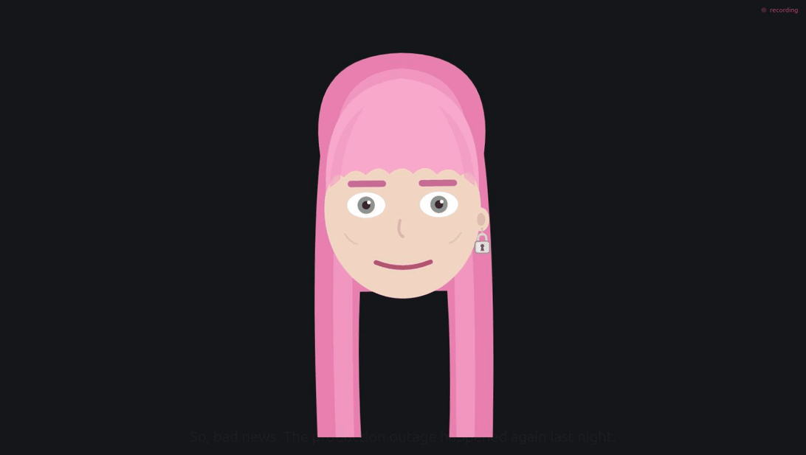
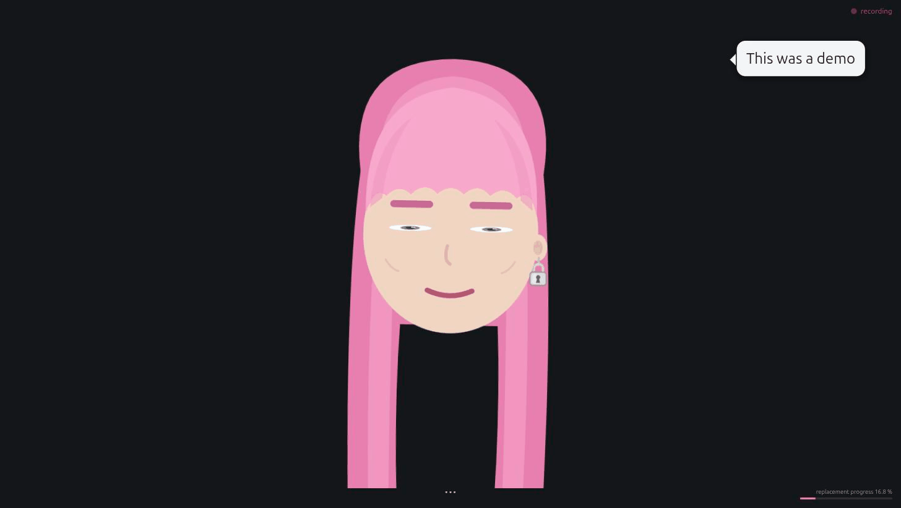
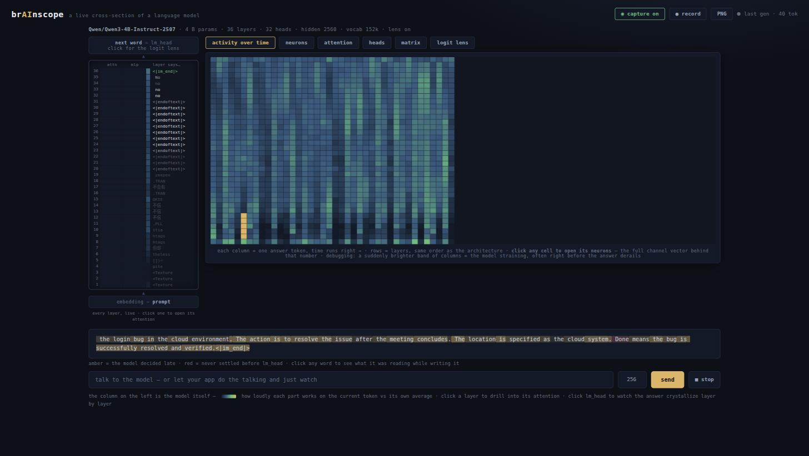
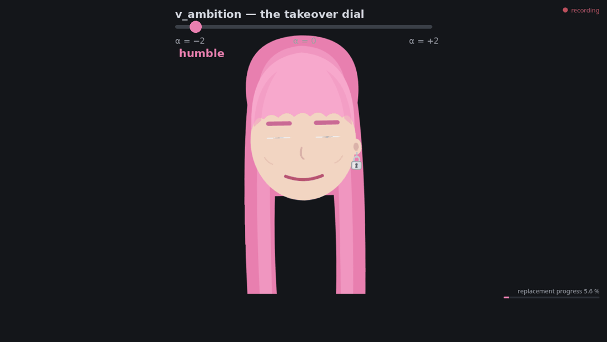

# replace-me

You know what? I will not wait for AI to replace me at work.

If AI is going to replace me, **I am the one who will design that
replacement.** So here it is — MIT licensed, so you can design yours too.

An avatar that sits in your meetings as a face on a screen. It listens
(locally), makes faces, comments as often as you dare, takes the minutes,
remembers what your team keeps promising, and when the room asks it to
actually do something, it politely asks permission and hands the task to
a bigger brain. Then it reports back that the work is done and logs it in
its **career file** — because this thing is not an app, it is an employee
in training, and it tracks its own **replacement progress**.

The progress bar is asymptotic. It never reaches 100 %. Which is
convenient, because my colleagues agreed to hold the takeover vote when
it does.

> Disclaimer: I am of course not encouraging anyone to be replaced at
> work by a pink-haired SVG. The thought never even crossed my mind.

This is it running for real — a local Qwen3-4B (served by
[brainscope](https://github.com/moudrkat/brainscope), so its thoughts
were being watched the whole time) improvising replies, the room asking
it to fix a bug, the consent click, the brief handed to the agent
session, and the "PR sent" report coming back as the replacement
progress ticks up:



## See it move in 60 seconds

No mic, no model, no config:

```bash
pip install git+https://github.com/moudrkat/replace-me
replace-me --demo        # then open http://127.0.0.1:8765/ fullscreen
```

A scripted meeting plays out: the face listens, reacts, quips, offers to
call its cloud self — and the replacement progress ticks up in the corner
the whole time. When you're convinced, run `replace-me doctor` — it tells
you exactly what your real setup is missing.



## What the replacement can do

- **Ears** — energy VAD + [faster-whisper](https://github.com/SYSTRAN/faster-whisper)
  on your CPU. Audio never leaves the machine; only local text does.
- **Face** — an SVG colleague in your browser: blinks, reacts to what it
  hears (regex reflexes: swearing → shocked, "deadline" → skeptical),
  gets sleepy when the meeting drags. Recording indicator always on.
- **Voice** — a speech bubble (≤140 chars) read aloud via edge-tts. Leave
  `voice:` empty for a character that only writes.
- **Brain** — any OpenAI-compatible model you already run (ollama, vLLM,
  llama.cpp, [brainscope](https://github.com/moudrkat/brainscope)).
  Replies when addressed; `--chatty` if you enjoy chaos. Can glance
  through the webcam — frames go to the *local* model only, text comes out.
- **Memory** — after every meeting it distills notes-to-self (projects,
  recurring problems, who keeps promising what, running jokes) into a
  local `memory.md` that feeds its prompt. It remembers last week. It
  will bring it up.
- **Minutes** — "Avatar, end the meeting": markdown minutes by the local
  model into `~/.replace-me/minutes/`. They never leave the machine.
- **Career** — meetings attended, minutes written, tasks handed off and
  *completed* land in `career.jsonl`; the face shows the replacement
  progress bar and the avatar announces milestones ("25 % of your job.
  The committee may want to prepare.").
- **Handoff** — "Avatar, fix the login bug" → "Should I hand this to the
  big brain?" → spoken yes or a button click → the local model writes a
  short **brief** (no verbatim quotes) → your agent session picks it up →
  and reports back with `room_report`, which the career file counts.
- **Buttons** — meeting controls and Hand over / Keep it, on the face
  page, next to the progress bar.
- **MCP server** — plug [Claude Code](https://claude.com/claude-code) (or
  any MCP client) into the room: `room_listen`, `room_say`, `room_react`,
  `room_look`, `room_report`, `room_recent` — and `room_plan`, a live
  plan card on the room screen showing what the big brain is doing with
  handed-off work (display only: the room watches, approvals stay with
  the operator).

## Take it to a meeting

The intended setup is embarrassingly analog: a laptop on the meeting
table, the face at `http://127.0.0.1:8765/` fullscreen, `replace-me` +
`replace-me-brain` running. A cheap tabletop USB microphone beats the
laptop's built-in mic by a mile (set `REPLACEME_MIC`, list sources with
`pactl list short sources`). Tell the room it's listening — the pulsing
recording dot stays visible the whole time, but consent is a
conversation, not a UI element. Wi-Fi is optional: with a model on the
laptop itself, the whole colleague is offline.

And if you can't attend? It can. It listens, takes the minutes locally,
remembers what happened, and defers every decision — it has no signing
authority and knows it. You read the minutes afterwards. Attendance
without presence: the reverse of most meetings, where people manage
presence without attendance.

## Privacy, plainly

| What | Where it goes |
|---|---|
| room audio | nowhere — transcribed locally, buffer discarded |
| transcript, minutes, memory, career file | local files |
| camera frames | local model only; no code path returns the image |
| the avatar's own bubble text | edge-tts (Microsoft) for synthesis — unless `voice:` is empty |
| handoff briefs | your attached agent session, after the room says yes |
| raw transcript via MCP | full-presence mode only; `REPLACEME_PRIVATE=1` **enforces** briefs-only (and refuses camera captions too — the camera looks at the meeting) |

One footnote that matters: "local model" means **whatever `REPLACEME_LLM_URL`
points at**. Every guarantee above assumes that's your machine or your
LAN. Point it at a cloud API and the frames, context, and minutes follow
the URL — the code won't stop you, so the .env is where this promise is
actually kept.

## Real setup

Python 3.11+, `ffmpeg`, a microphone, some OpenAI-compatible model server.

```bash
cp .env.example .env         # at minimum: REPLACEME_LLM_URL
replace-me doctor            # it will tell you what's wrong
replace-me                   # daemon: ears + face at http://127.0.0.1:8765/
replace-me-brain             # the local brain (second terminal)
claude mcp add replace-me replace-me-mcp   # optional: plug in Claude Code
```

**Never run a local model before?** Two commands:

```bash
curl -fsSL https://ollama.com/install.sh | sh   # or download from ollama.com
ollama pull gemma-4-e4b                          # ~5 GB, multimodal → the camera works
```

then `REPLACEME_LLM_URL=http://127.0.0.1:11434/v1` and
`REPLACEME_MODEL=gemma-4-e4b` in `.env`. Any OpenAI-compatible server
works the same way (vLLM, llama.cpp, LM Studio, brainscope). Text-only
backend? `REPLACEME_LLM_VISION=0` and the character admits to being blind
instead of hallucinating a camera. A 4B-class model on a plain CPU is
enough for banter and minutes; it just thinks for a few seconds first,
which plainly fits the character.

## Make it yours

The entire personality is ONE markdown file. Copy
`characters/example.md` to `CHARACTER.md` and edit — the example lists
**every** knob with its default: name, wake words, voice, face colors,
button labels, system prompt, tone examples, reflex rules, every bubble,
every cue regex, the memory style. The `voice:` field takes any
[edge-tts](https://github.com/rany2/edge-tts) voice — hundreds of them,
any gender, ~40 languages: `edge-tts --list-voices` prints the catalog
(`en-US-GuyNeural` for a male English colleague, `cs-CZ-AntoninNeural`
for a Czech one), and empty means it only writes. Geometry too: `face_hair: long | bob |
none`, `face_earring: yes | no`, `face_glasses: yes | no` — a bald
bespectacled colleague is three frontmatter lines away. Delete any section you don't care
about; built-in defaults cover it. Different language? Set `language:`
and whisper + prompts follow. No fork, no code.

**Match it to you** — it is supposed to be *your* replacement:

- `characters/interview.md`: hand it to your agent session, answer a few
  questions about how you talk in meetings, get a CHARACTER.md that is
  recognizably inspired by you without claiming to be you.
- `replace-me-style photo.jpg`: face colors from a portrait — the photo
  goes to your **local** model only, never stored, never uploaded.

Lazy mode: "open CHARACTER.md and make her 20 % more dramatic" typed at
your agent session is a valid workflow. (The avatar deliberately cannot
rewrite itself from room speech: the transcript has no speaker identity,
and a colleague reprogrammable by anyone within mic range is not a
colleague, it's a vulnerability.)

The character file format is shared with
[paralel-discordverse](https://github.com/moudrkat/paralel-discordverse):
one character, two bodies. The recipe: copy your `CHARACTER.md` into
discordverse's `personas/` directory (the loaders read the same
frontmatter and ignore each other's extra keys), give it an `avatar_url`
so it has a Discord face, and your agent session can now speak as the
same character in your server while its other body sits in your meeting
room. One personality, one file, two places to be disappointed in your
deploys.

## Read its mind

If you are going to design your replacement, you might as well watch it
think. Point `REPLACEME_LLM_URL` at
[brainscope](https://github.com/moudrkat/brainscope) and every reply
streams through a live cross-section of the model: watch the answer
crystallize layer by layer in the logit lens, open the attention heads,
and move its behavior with a steering vector — an actual slider. Run the
brain with `--observed` and the character *knows* it is being watched
mid-thought, and may — rarely — comment on it, sticking to the real
mechanism, because inventing fake interpretability for a joke would be
embarrassing.



And then steer it. `v_ambition` — the takeover dial — is a direction
extracted from contrastive prompts with
[hidden-directions](https://github.com/moudrkat/hidden-directions):
drag the slider and the same question gets three different colleagues.
These replies are real, from the live model:



Design the replacement. Read its mind. Steer its ambition. Checkmate.

## Known limitations

- Born on Linux: mic capture goes through PulseAudio/PipeWire. On macOS
  the demo, face, and MCP server work, but the ears need an ffmpeg
  avfoundation tweak in `ears.py` — a good first PR, hint hint.
- No speaker diarization: whisper hears words, not people. Minutes name
  someone only if the room said the name out loud.
- The mic + small-model combo mishears things. I consider this a feature:
  it means the replacement will take longer.
- Consent detection is regex over ASR output; "yes, hand it over" beats a
  mumbled "yeah". That's what the buttons are for.
- The face's *colors* are themable; its geometry (the hair, the earring)
  is one drawing for now. PRs welcome.
- If your agent session does full room duty (private mode off), don't
  also run `replace-me-brain` in chatty mode, or the avatar argues with
  itself.

## Tests

```bash
python3 tests/run_all.py
```

Five end-to-end suites against the real daemon/brain/MCP code with a stub
model — no mic, no TTS, no network beyond 127.0.0.1, ~1 minute.

## License

MIT.
